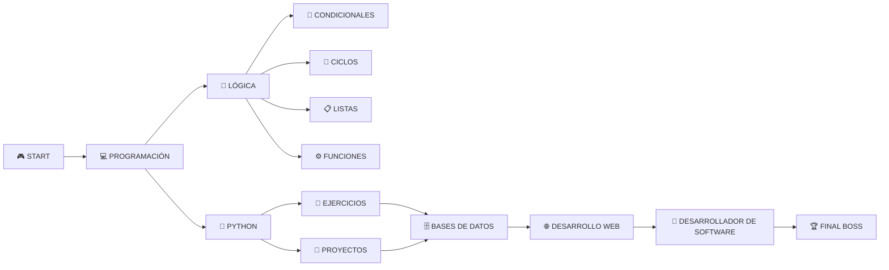

<div align="center">


# 👋 ¡Hola! Soy Sebastian

### 🎮 Estudiante de Programación | 💻 Técnico en Sistemas | 🚀 Futuro Desarrollador


<br>

> 🕹️ *"Aprendiendo, practicando y construyendo proyectos paso a paso."*

</div>

---

## 🧑‍💻 Sobre mí


Soy **Técnico en Sistemas** y actualmente estudio programación con el objetivo de convertirme en **desarrollador de software**.

Me gusta aprender mediante la práctica, resolver problemas y crear proyectos que me permitan aplicar nuevos conocimientos.

### 🎮 Player Info

- 🎓 Técnico en Sistemas
- 📚 Estudiante de programación
- 🐍 Aprendiendo Python
- 💻 Desarrollando proyectos
- 🧠 Mejorando mi lógica
- 🚀 Construyendo mi portafolio
- 🎯 En camino a ser desarrollador de software

<br clear="right"/>

---

## ⚡ Skills & Technologies

<div align="center">

### 🐍 Lenguajes

<a href="https://www.python.org/">

</a>

<a href="https://developer.mozilla.org/es/docs/Web/HTML">

</a>

<a href="https://developer.mozilla.org/es/docs/Web/CSS">

</a>

<br><br>

### 🛠️ Herramientas

<a href="https://git-scm.com/">

</a>

<a href="https://github.com/">

</a>

<a href="https://code.visualstudio.com/">

</a>

<a href="https://www.mysql.com/">

</a>

</div>

---

## 🎮 Mi progreso

<div align="center">

| 🕹️ Habilidad | 📈 Nivel |
|:---:|:---:|
| 🐍 Python | ⭐⭐⭐☆☆ |
| 🧠 Lógica | ⭐⭐⭐☆☆ |
| 🔀 Condicionales | ⭐⭐⭐⭐☆ |
| 🔄 Ciclos | ⭐⭐⭐⭐☆ |
| 📋 Listas | ⭐⭐⭐☆☆ |
| ⚙️ Funciones | ⭐⭐⭐☆☆ |
| 🗄️ MySQL | ⭐⭐☆☆☆ |
| 🌐 Desarrollo Web | ⭐⭐☆☆☆ |
| 🔧 Git & GitHub | ⭐⭐⭐☆☆ |

</div>

---

## 🗺️ Quest: Ruta del Desarrollador



---

## 📚 Actualmente aprendiendo

```text
- 🐍 Python
- 🧠 Lógica de programación
- 🔄 Estructuras repetitivas
- 🔀 Condicionales
- 📋 Listas y funciones
- 🗄️ Bases de datos
- 🌐 Desarrollo web
- 🔧 Git y GitHub

```

</div>


🚀 Proyectos
---

🐍 Ejercicios de Python

Colección de ejercicios realizados para practicar lógica de programación y fundamentos de Python.

📊 Proyecto SENA

Proyecto académico orientado al desarrollo de una solución tecnológica para solucionar una necesidad específica.

🚧 Próximamente

Nuevos proyectos para seguir construyendo mi portafolio y poner en práctica mis conocimientos.
</div>

---

## 🔥 GitHub Streak

<div align="center">


</div>

---

## 🏆 Mis objetivos

- 📚 Fortalecer mis bases en programación.
- 🐍 Dominar Python.
- 🗄️ Aprender bases de datos.
- 🌐 Desarrollar aplicaciones web.
- 💼 Construir un portafolio sólido.
- 🚀 Conseguir experiencia como desarrollador.

</div>

---

## 💡 Gamer Philosophy

<div align="center">


> *"No necesito saberlo todo para empezar; Solo necesito empezar para hacerlo."*

Cada ejercicio, error y proyecto representa un paso más en mi crecimiento como desarrollador.

</div>

---

## 📫 Contacto
<div align="center">


Si quieres conocer más sobre mi trabajo, puedes explorar mis repositorios aquí en GitHub.

### 🚀 Subiendo de nivel • Dominando el código • Superando límites • Construyendo mi futuro

<a href="https://github.com/S3bastian12">
  

</a>
<br><br>


</div>
